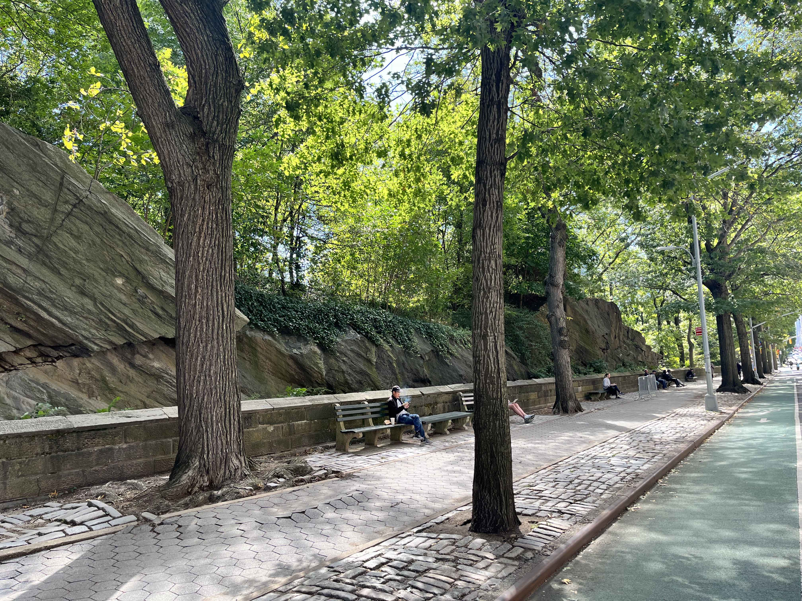
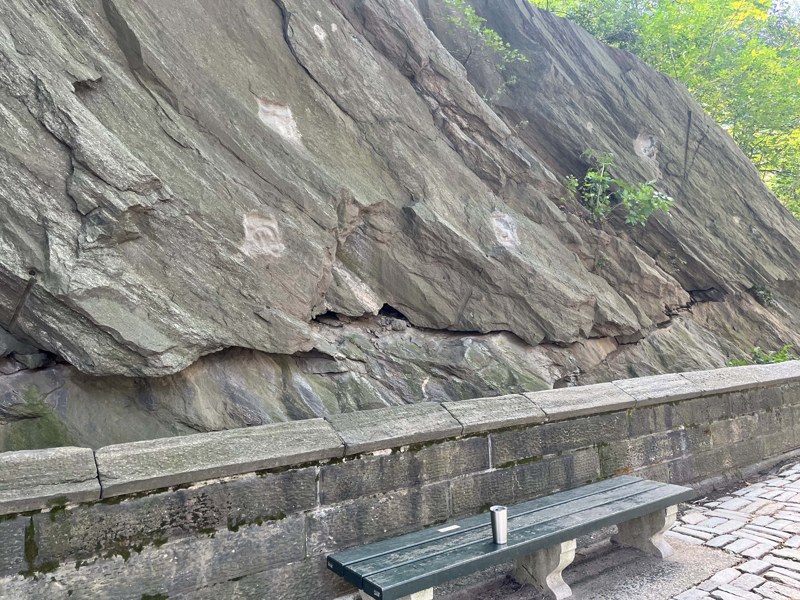
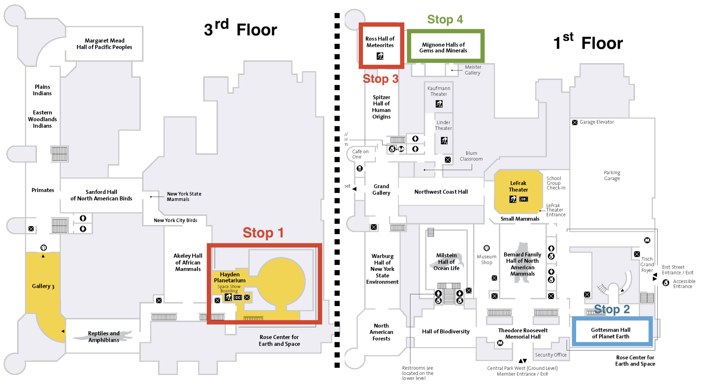
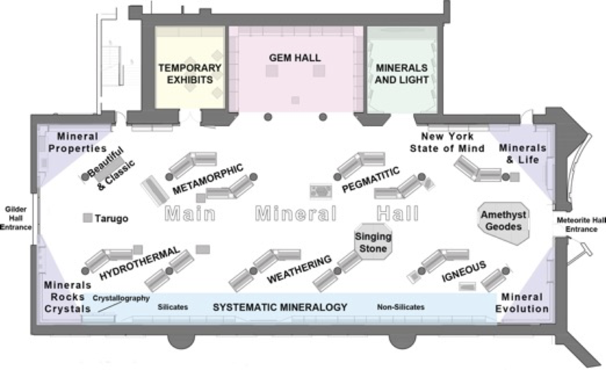

# GEO 203: Fundamentals of Solid Earth Science

## Field Trip \# 1: Central Park and American Museum of Natural History

*Due 11:59pm Thursday, October 6 via Gradescope upload (see Canvas link)*

IN THE SPACE BELOW, WRITE OUT IN FULL AND THEN SIGN THE HONOR PLEDGE:

“I pledge my honor that I have not violated the honor code during this examination.”

**PRINT NAME**:

By uploading this assignment through Canvas, I sign off on the document below electronically.

----

## Part I: Natural Features of Central Park

Welcome to the *Central Park* in New York City!

Central Park was the first landscaped public park in the United States. An irregular terrain of swamps and bluffs, punctuated by rocky outcrops, made the land between Fifth and Eighth avenues and 59th and 106th streets undesirable for private development. The building of Central Park was one of nineteenth-century New York’s most massive public works projects. Some 20,000 workers reshaped the topography to create the pastoral landscape. The park first opened for public use in the winter of 1859. 

However, it a widespread and persistent myth that Central Park is entirely artificial. The rocky outcrops in Central Park belong to a rock unit named the Manhattan Formation. Much of the Manhattan Formation is a metamorphic rock called *schist* and is quite pretty since it's primarily composed of flakes of *mica* which reflect sunlight creating a sparkly rock. The durable Manhattan schist that runs down the island's spine got its start about 450 million years ago as soft mud on an ancient seafloor. The sediments, compressed into metamorphic rock, were folded and forced to the surface by collisions of continents. 

These often hidden rock layers provide a fine foundation for the city's skyscrapers. In fact, it is because the bedrock is so close to the surface in many areas of Manhattan that the city can so easily support and anchor our towering skyscrapers. In other places, it is much more difficult to drill down to the bedrock and anchor the foundation of these huge buildings. Let us go to three stops representing the geological evolution of Manhattan, which laid the groundwork for this center of human civilization! 

### Stop 1: Umpire Rock
*Coordinates*: (40.7693156$^{\circ}$ N, 73.9779639$^{\circ}$ W), *Google Maps*: [Link](https://goo.gl/maps/JoxxsQ3jgbwggvDP8)

As you come near to the exposure with the playgrounds to your right, start by inspecting the rocks in front of you (Exposure A). Some veins or intrusions rich in quartz can be seen within the layers. In the roots of the mountain range where these rocks formed, pockets of melt developed which
were then squeezed and forced (intruded) into the adjacent solid rock. When the melt cooled, it
formed bodies of rock called **intrusions**. Note the sharp contacts of these intrusions with the surrounding rock.

**Question 1.1** Name and then classify the rock that forms the bulk of Umpire Rock. Is it an igneous, sedimentary, or metamorphic rock? Explain your reasoning. Name three minerals that you find.

**Answer:**

  
  

Exposure A | Vein | Grooves 
- | - | - 
 |  |  

Go around to the north-western face of the Umpire Rock. Step off rock exposure, stand on the soil or grass, and look at the rock face that slopes gently down towards you. Locate the foot-or-so wide, parallel **grooves** that extend for several yards up the outcrop. The origin of the grooves may be explained in terms of the movement of glaciers. About 15 thousand years ago, a giant body of flowing ice (a glacier) covered this area. Embedded in the ice at the bottom of the glacier were large boulders. As the ice pressed down on these boulders and dragged them over the underlying bedrock, grooves were carved in the bedrock. Smaller particles of rock that were dragged along created smaller grooves called **striations**.

**Question 1.2** Count the number of grooves in front of you. Using a compass, provide the two directions (in degrees from the North) that the parallel grooves orient towards. Standing back from the whole exposure, determine which of these directions has the gentler slope?

**Answer:**

  
  

### Stop 2: Sheep Meadow

*Coordinates*: (40.7706139$^{\circ}$ N, 73.9745944$^{\circ}$ W), *Google Maps*: [Link](https://goo.gl/maps/duVFdX1VzjeETK9K9)

Enter Sheep Meadow through the small gate and walk toward the large outcrop of rock on your left with many boulders perched on top. Look at the layers in this area (Exposure B). Observe that the rock is layered, and the layers appear folded. Also note the numerous grooves parallel to the layers that exist where some of the layers have been worn (eroded) more deeply than others. 

**Question 1.3** Are the grooves parallel to the layering in the rock? Could they be due to differential erosion of the layers in the rock? Did the grooves form before or after the folding of the rock layers? 

**Answer:**

  
  

Entrance | Exposure B 
- | - 
 |  

**Question 1.4** Find some striations. What is their orientation with respect to the grooves? Provide the two directions of grooves themselves in this area (in degrees from the North). Are these values similar to those obtained in Stop 1? What does this and the direction of gentler slopes tell you about the flow of glaciers in this area?

**Answer:**

  
  

Striations | Erratics
- | - 
 |  

Checkout the boulders that lie scattered on the surface of the rock exposure. Walk to the large boulder perched on the rock. There was a similarly large boulder precariously perched on top of the ancient glistening bedrock near the carousel on your way from Stop 1. These boulders are called **erratics**.

**Question 1.5:** Describe the boulders. What is the general grain size? Name three minerals present in the largest boulder. What rock type is the boulder? Explain how the boulder got to its present position (It was not placed there by people!). Assume that you have just heard from the grapevine that there are rock formations similar to this boulder (but dissimilar to the bedrock!) to the north of Manhattan!

**Answer:**

  
  

### Stop 3: Road Cut next to the Museum
*Coordinates*: (40.7828557$^{\circ}$ N, 73.9710358$^{\circ}$ W), *Google Maps*: [Link](https://goo.gl/maps/vN34Luorr3BzGm5UA)

Layers | Zoomed In
- | - 
 |  

**Question 1.6.** Engineers and construction workers often have to blast or drill through layers of rock. This creates opportunities for geoscientists to probe the interior and test their hypotheses. The cross-section of bedrock above on Central Park West shows how the layers of Manhattan schist are tilted. Using a compass, provide the direction towards which the these layers are tilted? How does this direction compare with the direction that glaciers moved based on Stop 2 above? Based on this, can you infer which came first - folding of layers due to continental collisions or movement of glaciers?

**Answer:**

  
  

## Part II: Exploring the American Museum of Natural History

The American Museum of Natural History (abbreviated as AMNH) is a natural history museum on the Upper West Side of Manhattan in New York City. The museum complex comprises 26 interconnected buildings housing 45 permanent exhibition halls, in addition to a planetarium and a library. AMNH averages about five million visits annually and our visit will only delve into a small portion relevant to a better understanding of the Solid Earth!

We will start off by seeing the "Worlds Beyond Earth" show at the Hayden Planetarium. This is **Stop 1** on the 3rd floor map below. See the link below for a preview and information about the show: https://www.amnh.org/exhibitions/permanent/hayden-planetarium/worlds-beyond-earth. Next, you will proceed downstairs to the 1st floor to explore the Gottesman Hall of Planet Earth (**Stop 2**), Ross Hall of Meteorites (**Stop 3**), and Mignone Halls of Gems and Minerals (**Stop 4**). You should aim to make it to **Stop 3** and **Stop 4** right after lunch (i.e. latest by 12:30 PM) so that you can spend adequate time exploring the amazing exhibits there!

**Note: Only 5 out of the 15 questions below are required; note the annotation next to such questions. You need to answer 10 questions including the 5 required ones. If you answer more than 10 questions, we will take your best scores among the optional ones you answered. Skip up to 5 questions so that you find time to wander about!**

### Stop 1: Hayden Planetarium, 3rd floor

**Question 2.1**. What to you was the most insightful visualization in the show? What did you learn about the Earth and/or the solar system? Did it involve a prediction/simulation, analysis of current observations, or both?  (**required**)

**Answer:** 

  
  

### Stop 2: Gottesman Hall of Planet Earth, 1st floor

**Question 2.2**. Which is your favorite rock or 'outcrop' in the Hall of Planet Earth? Why is it significant and what does it tell us about the Earth?  (**required**)

**Answer:** 

  
  

**Question 2.3**. Take a look at the ice core model. In addition to temperature reconstructions based on oxygen isotopes, what other data can be obtained from ice cores and other samples and how do those data tell us about paleoclimate? Comment quantitatively about the recent increase in temperatures worldwide versus the last century. 
**Note**: *Choose any set of parameters, identify a trend in values over time and/or describe its geographic variations around the world to substantiate your point.*   (**required**)

**Answer:** 

  
  

### Stop 3: Ross Hall of Meteorites, 1st floor

**Question 2.4**. How do meteorites form? What are they made of? **Attach a photo** of your favorite meteorite, and describe its nature and story. (**required**)

**Answer:** 

  
  

**Question 2.5**. What are chondrules? Why are they important in studying the Earth's history?

**Answer:** 

  
  

**Question 2.6**. How do we know when a meteorite is sourced from Mars? Why are these types of meteorites particularly important?

**Answer:** 

  
  

**Question 2.7**. Can asteroids undergo the process of differentiation like Earth did during its evolution? How can meteorites inform our understanding of this process?

**Answer:** 

  
  

### Stop 4: Mignone Halls of Gems and Minerals, 1st floor
The recently renovated Mignone Hall of Gems and Minerals feature more than five thousand specimens from ninety-eight countries and a wide range of geologic environments. This is only a fraction of the museum’s overall collection of two hundred thousand specimens.  

**Question 2.8**. List the five important environments for mineral/gem formation.  Give an example of at least one gemstone found in each. (**required**)

**Answer:** 

  
  

**Question 2.9**. List as many varieties of quartz as you can find on display. **Attach a photo of your favorite one** and list any relevant details (e.g. where it is from).

**Answer:** 

  
  

**Question 2.10**. Head over to the **Systematic Mineralogy** section of the Hall. *Compare* and *contrast* any **two** of the following groups: Sulfates, Phosphates, Carbonates.

**Answer:** 

  
  

**Question 2.11**. List four types of chemical bonds with examples of minerals. How do atomic bonding influence the crystal systems? *Cue*: Head to the **Mineral Properties** section of the Hall.

**Answer:** 

  
  

**Question 2.12**. What is a solid solution? **Attach the image** of an example and describe its formation, composition and/or potential uses for understanding Earth processes.

**Answer:** 

  
  

**Question 2.13**. What gem is found at Gore Mountain in New York? Briefly describe how it is formed.

**Answer:** 

  
  

**Question 2.14**. Locate the 3-meter tall pillar of Madagascar labradorite? What kind of mineral is labradorite? What is responsible for the phenomenon of labradorescence?

**Answer:** 

  
  

**Question 2.15**. Locate the pegmatite. Summarize its mineralogy and method of formation. Why can pegmatites produce large crystals?

**Answer:** 

  
  

### Optional Things to Check Out in the Museum

- **Titanosaur skeleton**, the head of which peers out of the Wallach Orientation Center (guide to the fossil halls).
- **The Blue Whale, Milstein Hall of Ocean Life**, a 94-foot fiberglass model, suspended in air.
- **Cross section of a Giant Sequoia tree, North American Forests exhibit** - the tree from which it was cut was 331 feet tall and measured 90 feet around the base of the trunk.
- **The largest stibnite (Sb2S3) specimen in the world** - Reminds me of the sword throne in "Game of Thrones"
- **Largest Topaz in the World**, also the **Star of India** gem, and the **Best Sulfur crystals I have seen**, all in the Hall of Minerals
