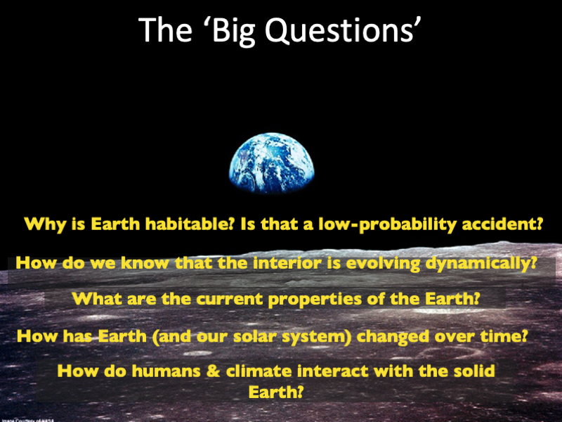

# Fundamentals of Solid Earth Science
 

**Want to test-drive this course?** Check out our live examples on Hubzero 

**Designed by [Raj Moulik](https://rajmoulik.com) // Maintained by [Global Seismology](https://globalseismology.org)**

**Courtesy [AVNI](http://avni.globalseismology.org) software ecosystem // Powered by [Jupyter](https://jupyter.org)**  

This website hosts the interactive book, *Fundamentals of Solid Earth Science*, which offers an introduction to a smorgasbord of introductory topics using the Python programming language. The content is specifically designed for people interested in geoscience education using some of the latest computational tools. This website is part of the software ecosystem called **A**nalysis and **V**isualization toolkit for pla**N**etary **I**nferences (or **AVNI**), which provides free web-based and backend code access to tools, techniques, models and data related to global solid Earth geosciences.

These materials were originally created by Raj Moulik while teaching *Fundamentals of Solid Earth Science* (GEO203/CEE203), an undergraduate course at [Princeton University](https://princeton.edu). Checkout our overarching [pedagogy](#summary-of-the-pedagogy) of technology-assisted learning and programming in Geoscience education. If you find any of these resources useful, kindly [cite it](#suggested-citation) in your work.

## Quick Links  
- [Course Website](https://portal.globalseismology.org/courses/solid-earth-fundamentals)
- [Live Interactive Code on Hubzero](https://geodynamics.org/tools/solidearth)
- [Example: Intro Lecture](https://portal.globalseismology.org/courses/solid-earth-fundamentals/current/Lectures/Lecture1_2022_CourseOverview_Earth-as-a-natural-system.html)
- [Example: Geophysical Field Trip](bin/Field_Trip_Geophysics/Field_Geophysics.ipynb)
- [Example: Problem Set on Plate Tectonics](bin/PS_Plate_Tectonics/Plate_Tectonics.ipynb)
- [Overview, Logistics and Policies](bin/Overview-Logistics-Policies.ipynb)
- [Syllabus and Required Readings](bin/docs/Admin/Syllabus_Readings.ipynb)
- [Table of Contents](#table-of-contents)

*Students use their smartphones with hockey sticks and a wooden dump truck to find and characterize a magnetic dike (Oct, 2022). See Teachable Moments on Data and Signal Processing in [this notebook](bin/Field_Trip_Geophysics/Field_Geophysics.ipynb).*

## What is Solid Earth Science? 

This book provides a quantitative introduction to the geosciences, focusing on the *physical*, *chemical*, and *biological* processes that created and continually influence the habitable conditions on our planet. Earth’s biosphere, atmosphere, ocean, cryosphere, surface & interior form a coupled system, interacting through processes that operate over a wide range of spatial & temporal scales. Various physical, chemical & biological processes, such as meteorite impacts, glaciation & erosion, erase the geological memory of Earth’s outermost layers. The solid interior, in contrast, harbors the long-term memory of transformations that shape our planet. These include accretion & the evolution of the crust, mantle & core through differentiation, plate tectonics, climate change & anthropogenic forcing. Human interactions with the solid interior include extraction of natural resources and engineering to mitigate the effects of environmental risks and disasters. We will end with the evolution of life and climate, long-term transformations that are either recorded by or have feedbacks with the solid Earth.

**Learn to tackle the 'Big Questions'...**

 

**Interactive Code <i class="fa fa-rocket" aria-hidden="true"></i>**  

You will learn how to modify and leverage our Python code to solve real-world problems. The course **does not require prior programming experience**. By the end of it, you would have seen the power of learning this new language of modern computing!

This book's pages contain Python code that can be opened and run in a web browser without any prior installation or configuration. Click the launch button <i class="fa fa-rocket" aria-hidden="true"></i> in the top right corner of any page to open and play with the code. See [How To Interact With This Book](bin/How-To-Interact-With-This-Book.ipynb) for more information.

## Summary of the Pedagogy

Geoscience departments are responsible for educating young minds about vital issues like natural resources, climate change, earthquakes, and other natural hazards. The core idea of a geoscience course is to use our planet as the key component for elucidating the universal crosscutting scientific concepts such as those of energy & matter. Along the way, more advanced topics such as planetary thermodynamics, structural geology, petrology, and sedimentology, are introduced. In *Fundamentals of Solid Earth Science*, we adopted a quantitative and computational way of learning these geoscience concepts through Python programming and Jupyter Notebooks. Programming tools were utilized in interactive components and computational workflows during all three components of the course - *lectures*, *field trips* and *problem sets*. During *lectures*, several interactive components were used – *Who am I?* or *Mine me*, *blackboard*, and *classroom activity*. For example, a *classroom activity* involved a tactile or programming demonstration, such as on fault mechanics and pore pressures. *Field trips* introduced the entire cycle of design, acquisition, processing, modeling and interpretation of data. For example, on a geophysical *field trip* along the Delaware-Raritan Canal, students tied their smartphones to ice hockey sticks and a wooden dump truck to find and characterize a magnetic dike. Students were exposed to concepts in data science and signal processing, such as the procedure of stacking to amplify the signal of a magnetic anomaly. A geological *field trip* in New Jersey was coupled with an industrial site visit to GeoExchange boring wells; data from both were analyzed to explore the geologically informed efficacy of the engineering design. A *problem set* extended classical geological concepts of identifying the clast size distribution and mineral identification for rock classification using image processing and cluster analysis in Python. These activities allowed students to see the practical application of a programming approach and learning within a group promoted teamwork and individual progress. Several students had no prior programming experience but learnt about its utility as they modified our codes and learnt from tutorials to answer the problem sets. Technology-assisted learning tools are critical for improving retention of geoscience concepts through interactive components, for introducing computational workflows through programming, and for improving accessibility to education worldwide, especially during unforeseen situations like a pandemic.

## What Students Had to Say

*These comments have not been edited although only a selection appears.*

- "Amazing class, extremely interesting"
- "If you're interested in GEO, take this course. The problem sets were not something to brush off but were very engaging and extremely interesting."
- "Problem sets and field trips are very well designed"
- "The readings were great and the visuals were very interesting"
- "Moulik is great and I really liked him. He did go through a lot of content in the semester, and he is an expert on a lot of it, and it was really cool to be able to hear about the seismic stuff that he actually researches."

## Suggested Citation

To cite specific version numbers of the course software, you can use the DOIs
provided by [Zenodo](https://doi.org/10.5281/zenodo.7876674).
Additionally, we ask that when citing this course package, you cite
both the course website and the canonical journal article reference 
        
> Moulik, P. (2023), AVNI: Web-based Model Prototyping and Data Analysis Workflows for Planetary Inferences. *Geochemistry, Geophysics, Geosystems*, in prep.

> Moulik, P. (2022), AVNI Course: Fundamentals of Solid Earth Science, [https://portal.globalseismology.org/courses/solid-earth-fundamentals](https://portal.globalseismology.org/courses/solid-earth-fundamentals)

## License 

This software is published under the GNU GPL v3 license - see the
[LICENSE](LICENSE) file for details. Please write to
**avni@globalseismology.org** or see our
[FAQs](http://avni.globalseismology.org/stable/overview/faq.html) for additional
clarifications. 

## Acknowledgements  

A project like this one is a culmination of feedback and input from several excellent colleagues and organizations. Some of them are listed in the [Acknowledgements](bin/Acknowledgements.ipynb). 

## Feedback 

This is an evolving document so please send [Raj Moulik](mailto:moulik@princeton.edu?cc=moulik@caa.columbia.edu) or the [AVNI Administrators](mailto:avni@globalseismology.org) any constructive feedback or suggestions. 

## Table of Contents

- **The Course**
  - [Course Overview, Logistics & Policies](bin/Overview-Logistics-Policies.ipynb)
  - [Acknowledgements](bin/Acknowledgements.ipynb)
  - [Syllabus & Readings](bin/docs/Admin/Syllabus_Readings.ipynb)
- **How To**
  - [Interact With This Book](bin/How-To-Interact-With-This-Book.ipynb)
  - [Restricted Content](bin/Restricted-Content.ipynb)
- **Field Trips**
  - [(A) Central Park & American Museum of Natural History](bin/Field_Trip_AMNH/Field_Trip_AMNH_worksheet.ipynb)
  - [(B) Geophysical Field Survey](bin/Field_Trip_Geophysics/Field_Geophysics.ipynb)
  - [(C) GeoExchange Site Visit & Geology Field Trip](bin/Field_Trip_Local_Geology/GeoExchange_and_Field_Trip.ipynb)
- **Problem Sets**
  - [(i) Plate Tectonics](bin/PS_Plate_Tectonics/Plate_Tectonics.ipynb)
  - [(ii) Pressure, Plate Motion & Quake Magnitude](bin/PS_Pressure_Plate_Motion_Quake_Magnitude/Pressure_Plate_Motion_Quake_Magnitude.ipynb)
  - [(iii) Minerals](bin/PS_Minerals/Minerals.ipynb)
  - [(iv) Rocks](bin/PS_Rocks/Rocks.ipynb)
  - [(v) Relative & Absolute Dating](bin/PS_Relative_Absolute_Dating/Dating.ipynb)
  - [(vi) Seismology & Isostasy](bin/PS_Seismology_Isostasy/Seismology_Isostasy.ipynb)
  - [(vii) Climate](bin/PS_Climate/Climate.ipynb)
  - [(viii) Human Interactions](bin/PS_Human_Interactions/Human_Interactions.ipynb)
- **Lectures**
  - [(1) Course Overview - Earth as a Natural System](https://portal.globalseismology.org/courses/solid-earth-fundamentals/current/Lectures/Lecture1_2022_CourseOverview_Earth-as-a-natural-system.html)
  - [(2) Stellar Formation & Nucleosynthesis](https://portal.globalseismology.org/courses/solid-earth-fundamentals/current/Lectures/Lecture2_2022_Stellar-formation-and-nucleosynthesis.html)
  - [(3) Comparative Planetology](https://portal.globalseismology.org/courses/solid-earth-fundamentals/current/Lectures/Lecture3_2022_Comparative_Planetology.html)
  - [(4) Plate Tectonics - The Evidence](https://portal.globalseismology.org/courses/solid-earth-fundamentals/current/Lectures/Lecture4_2022_Plate-Tectonics-the-Evidence.html)
  - [(5) Plate Tectonics - The Theory](https://portal.globalseismology.org/courses/solid-earth-fundamentals/current/Lectures/Lecture5_2022_Plate-Tectonics-the-Theory.html)
  - [(6) Phenomenology of Natural Disasters](https://portal.globalseismology.org/courses/solid-earth-fundamentals/current/Lectures/Lecture6_2022_Phenomenology-of-Natural-Disasters.html)
  - [(7) Minerals](https://portal.globalseismology.org/courses/solid-earth-fundamentals/current/Lectures/Lecture7_Minerals.html)
  - [(8) The Rock Cycle I - Introduction to Igneous Rocks](https://portal.globalseismology.org/courses/solid-earth-fundamentals/current/Lectures/Lecture8_TheRockCycleI-Intro-IgneousRocks.html)
  - [(9) The Rock Cycle II - Composition & Phase Diagrams](https://portal.globalseismology.org/courses/solid-earth-fundamentals/current/Lectures/Lecture9_TheRockCycleII-Composition-and-Phase-Diagrams.html)
  - [(10) The Rock Cycle III - Metamorphic & Sedimentary Rocks](https://portal.globalseismology.org/courses/solid-earth-fundamentals/current/Lectures/Lecture10_TheRockCycleIII-Metamorphic-SedimentaryRocks.html)
  - [(11) Radiogenic Isotopes & Absolute Dating](https://portal.globalseismology.org/courses/solid-earth-fundamentals/current/Lectures/Lecture11_Radiogenic-isotopes-and-absolute-dating.html)
  - [(12) Isostasy & Topography](https://portal.globalseismology.org/courses/solid-earth-fundamentals/current/Lectures/Lecture12_Isostasy-and-Earth-Topography.html)
  - [(13) Stress, Strain & Deformation](https://portal.globalseismology.org/courses/solid-earth-fundamentals/current/Lectures/Lecture13_2022_Stress_Strain_and_Deformation.html)
  - [(14) Constitutive Relations & Viscoelasticity](https://portal.globalseismology.org/courses/solid-earth-fundamentals/current/Lectures/Lecture14_2022_Constitutive_Relations_and_Viscoelasticity.html)
  - [(15) Brittle Rheology & Fault Mechanics](https://portal.globalseismology.org/courses/solid-earth-fundamentals/current/Lectures/Lecture15_2022_Brittle_Rheology_and_Fault_Mechanics.html)
  - [(16) Flow Laws & Deformation Signatures](https://portal.globalseismology.org/courses/solid-earth-fundamentals/current/Lectures/Lecture16_2022_Flow_Laws_and_Deformation_Signatures.html)
  - [(17) Basics of Seismology](https://portal.globalseismology.org/courses/solid-earth-fundamentals/current/Lectures/Lecture17_2022_Basics_of_Seismology.html)
  - [(18) Seismology & Radial Structure](https://portal.globalseismology.org/courses/solid-earth-fundamentals/current/Lectures/Lecture18_2022_Seismology_and_Radial_Structure.html)
  - [(19) 3D Structure of the Earth](https://portal.globalseismology.org/courses/solid-earth-fundamentals/current/Lectures/Lecture19_2022_Structure_of_the_Earth.html)
  - [(20) Risks & Disasters](https://portal.globalseismology.org/courses/solid-earth-fundamentals/current/Lectures/Lecture20_2022_Risks_and_Disasters.ipynb)
  - [(21) Long Term Natural Climate System](https://portal.globalseismology.org/courses/solid-earth-fundamentals/current/Lectures/Lecture21_2022_Long_Term_Natural_Climate_System.html)
  - [(22) Human Interactions with Climate & Natural Resources](https://portal.globalseismology.org/courses/solid-earth-fundamentals/current/Lectures/Lecture22_2022_Human_Interactions_Climate_and_Resources.html)
- **Tutorials**
  - [(a) Markdown](bin/PS_Setup/00_Markdown/markdown_tutorial.ipynb)
  - [(b) Command Line](bin/PS_Setup/01_Command_Line/command_line_tutorial.ipynb)
  - [(c) Basics of Numpy](bin/PS_Setup/02_Intro_Python/1_Basic_Numpy.ipynb)
  - [(d) Basics of Plotting](bin/PS_Setup/02_Intro_Python/2_Basic_Plotting.ipynb)
  - [(e) Some Python Libraries](bin/PS_Setup/03_Basic_Libraries/Basic_Libraries.ipynb)
- **Reading Quizzes**
  - [(i) Stellar Formation & Comparative Planetology](https://portal.globalseismology.org/courses/solid-earth-fundamentals/current/Reading_Quizzes/Quiz_Stellar_Formation_and_Comparative_Planetology.html)
  - [(ii) Plate Tectonics](https://portal.globalseismology.org/courses/solid-earth-fundamentals/current/Reading_Quizzes/Quiz_Plate_Tectonics.html)
  - [(iii) Minerals](https://portal.globalseismology.org/courses/solid-earth-fundamentals/current/Reading_Quizzes/Quiz_Minerals.html)
  - [(iv) Rocks](https://portal.globalseismology.org/courses/solid-earth-fundamentals/current/Reading_Quizzes/Quiz_Rocks.html)
  - [(v) Dating](https://portal.globalseismology.org/courses/solid-earth-fundamentals/current/Reading_Quizzes/Quiz_Dating.html)
  - [(vi) Rheology & Deformation](https://portal.globalseismology.org/courses/solid-earth-fundamentals/current/Reading_Quizzes/Quiz_Rheology_and_Deformation.html)
  - [(vii) Seismology](https://portal.globalseismology.org/courses/solid-earth-fundamentals/current/Reading_Quizzes/Quiz_Seismology.html)
  - [(viii) Climate & Natural Resources](https://portal.globalseismology.org/courses/solid-earth-fundamentals/current/Reading_Quizzes/Quiz_Climate_Resources.html)