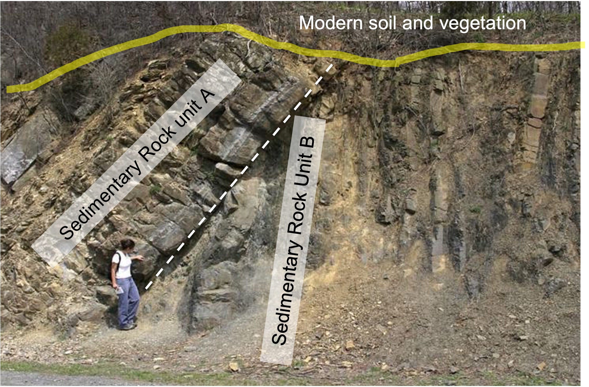

# Quiz: Dating

IN THE SPACE BELOW, WRITE OUT IN FULL AND THEN SIGN THE HONOR PLEDGE:

“I pledge my honor that I have not violated the honor code during this examination.”

**PRINT NAME**:

By uploading this assignment through Canvas, I sign off on the document below electronically.

----

## Instructions

This is an open book, open notes quiz to be done independently, on your own.  But it is not open Internet - on your honor, you are not permitted to "Google" for answers.

Unless otherwise indicated the multiple choice questions have only one correct answer. Once started, you have 20 minutes to finish.

When done, click **Submit Quiz** at the bottom of the page.  Note that by submitting this quiz, you are acknowledging the following statement:

       “I pledge my honor that I have not violated the honor code during this examination.”
Please tick your choice(s) from the list of options provided.  Note that <u>several choices may be correct</u>, so tick all choices you think are appropriate.

----

Q1. The photo below shows a bedrock exposure of two sedimentary units, A and B, and the overlying modern soil and vegetation that overly them.  The white dashed line is the contact between the two units.  Which is the older unit?

1. A
2. B

Q2. In a few sentences, justify your response to the question above.

Q3. The contact between units A and B most likely represents which type of structure?
  1. Unconformity
  2. Normal fault
  3. Reverse fault
  4. Strike-slip fault

Q4. In list form below, create a generalized, relative sequence of events that could have resulted in the outcrop as we see it today.  Your list should include only the following components, but "Deformation event" and "Erosion" may be used more than once.  Make it clear whether you list goes from youngest to oldest, or oldest to youngest.

- Formation of Unit A

- Formation of Unit B

- Deformation event (maybe used more than once)

- Erosion (may be used more than once)

Q5. In the 1800s, Lord Kelvin estimated the age of the Earth, utilizing a number of assumptions. Which wrong assumption was the primary reason why his estimate (of approximately 20 million years) was so wildly inaccurate?
  1. That the Earth was once hotter than it presently is today.
  2. That the Earth may have been molten when first formed.
  3. That no new heat has been added to the Earth since its initial formation.  
  4. That the Earth would lose heat over time through radiation into outer space.

Q6. What is the difference between a rock with a clastic texture and rock with a a crystalline texture?
  1. A clastic rock contains rounded grains held together by a cementing material, whereas a crystalline rock contains angular grains held together with cement.
  2. A clastic rock contains grains formed by chemical precipitation, whereas crystalline rocks contain grains formed by erosion of pre-existing rocks.
  3. A clastic rock contains grains held together by their interlocking ground boundaries, whereas a crystalline rock contains grains held by cement.
  4. A clastic rock contains grains held together by cement, whereas a crystalline rock contain grains held together by their interlocking grain boundaries.

Q7. How much of a radioactive parent isotope will remain after three half-lives have passed?
  1. three-halves
  2. three-quarters 
  3. one-third 
  4. one-eighth   

Q8. The closure temperature of a system represents the point when:
  1. a magma cools to the point where minerals begin to crystallize. 
  2. radioactive isotopes begin to decay. 
  3. isotopes are no longer free to move out of a crystal lattice.  
  4. the last remaining magma crystallizes. 

Q9. Which of these properly illustrates the principle of isostasy?
  1. Mountains stand high because they are gravitationally balanced by their deep crustal roots. 
  2. When weight is added to the crust, the crust responds by rebounding upward.
  3. High-density crust floats on top of low-density mantle. 
  4. When material is removed from the crust, the crust maintains the new, lower elevation.  

Q10. What is the primary reason why mountains substantially taller than Mt. Everest are unlikely to arise on the Earth?

  1. Exhumation proceeds faster than uplift. 
  2. The high geothermal gradient in the crust causes mountains to collapse under their own weight.
  3. Extreme elevations cause chemical weathering to outpace uplift. 
  4. Uplift is limited by the rate of subduction. 

Q11. Normal faulting is most often associated with mountain building along __ boundaries, whereas reverse faulting is typically observed at __ boundaries.

  1. divergent; transform 
  2. transform; convergent 
  3. convergent; divergent 
  4. divergent; convergent 

Q12. Both the Appalachian Mountains and the Rocky Mountains are comples zones of faulting and folding.  However, compared to the rugged Rocky Mountains, the Appalachian Mountains are a series of gently sloping hills.  Why?

  1. The Appalachian formed under divergent tectonics associated with mid-Atlantic ridge. 
  2. The lithosphere under the Appalachains is thinner and weaker and thus cannot support the load. 
  3. Because of the wetter climate in the east, erosion is much faster than in the western US. 
  4. The Appalachian Moutains are much older than the Rockies. 
