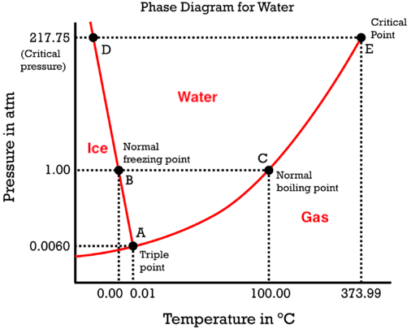

# Quiz: Minerals

IN THE SPACE BELOW, WRITE OUT IN FULL AND THEN SIGN THE HONOR PLEDGE:

“I pledge my honor that I have not violated the honor code during this examination.”

**PRINT NAME**:

By uploading this assignment through Canvas, I sign off on the document below electronically.

----

## Instructions

This is an open book, open notes quiz to be done independently, on your own.  But it is not open Internet - on your honor, you are not permitted to "Google" for answers.

Unless otherwise indicated the multiple choice questions have only one correct answer. Once started, you have 20 minutes to finish.

When done, click **Submit Quiz** at the bottom of the page.  Note that by submitting this quiz, you are acknowledging the following statement:

       “I pledge my honor that I have not violated the honor code during this examination.”
Please tick your choice(s) from the list of options provided.  Note that <u>several choices may be correct</u>, so tick all choices you think are appropriate.

----

Q1. Which mineral class is most common in the Earth's continental crust?

1. Halides
2. Silicates
3. Sulfates
4. Native Metals

Q2. Which of the following statements is true about the **silica tetrahedron**?  Check all that apply.
  1. It is deficient in electrons i.e. it is a cation 
  2. It has extra electrons i.e. it is an anion
  3. Silicate minerals can form by sharing the Silicon atom
  4. Silicate minerals can form by sharing the Oxygen atom(s) 

Q3. Diamond and graphite, both made purely of carbon atoms, can sit next to each other in your cupboard without reacting during your lifetime. Which **statement on thermodynamics** explains this observation? 
  1. Crystalline structure of diamond is arranged in tetrahedra, a more stable form in the deep interior
  2. Graphite and Diamond do not react because the types of carbon bonds are different 
  3. Diamond is metastable at the pressure-temperature conditions on the Earth's surface
  4. Graphite has a lower 'chemical energy' on the Earth's surface 

Q4. Icebergs float even though ice is the solid form of water since it is less dense. In other words, while entropy increases from ice (solid) to water (liquid) like most substances, volume surprisingly decreases from ice to water. Which feature of the phase diagram below results from this unique feature of water?

  1. Freezing point on the Earth's surface (1 atm) is lower than the boiling point 
  2. There is a triple point where all three phases exist 
  3. There is a critical point of temperature, beyond which no amount of pressure can perform the conversion 
  3. The Clapeyron slope (dP/dT=dS/dV) of the transition is negative (A-B-D curve) 

Q5. Which statement can be used to decide if a given natural process *should* be spontaneous?
  1. Entropy always increases in a spontaneous process.
  2. The Gibbs Energy always decreases in a spontaneous process.  
  3. The enthalpy change from reactants to products is positive, i.e. an exothermic process.
  4. There is an increase in the internal energy stored by the system when applied pressure causes a change in volume.

Q6. Which of the following type of melting best explains the processes in the subducting plate that results  in arc volcanoes? 
  1. decompression melting 
  2. flux melting
  3. heat-tranfer melting

Q7. On what factor does the texture, or the grain/crystal size distribution, of igneous rocks primarily depend on?
  1. Initial magma temperatures 
  2. Cooling rate
  3. Pressure of magma chamber
  4. Magma composition

Q8. What type of igneous activity are Columbia River Basalts and Deccan Plateau typical examples of?
  1. Hotspot volcanism 
  2. Volcanic arc 
  3. Large Igneous Province
  4. Mid-ocean ridge volcanism
