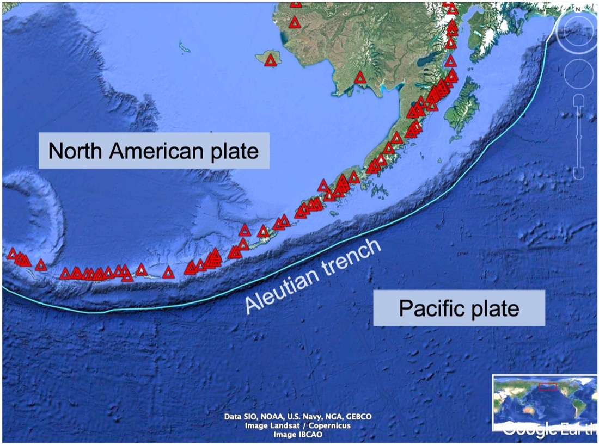

# Quiz: Plate Tectonics

IN THE SPACE BELOW, WRITE OUT IN FULL AND THEN SIGN THE HONOR PLEDGE:

“I pledge my honor that I have not violated the honor code during this examination.”

**PRINT NAME**:

By uploading this assignment through Canvas, I sign off on the document below electronically.

----

## Instructions

This is an open book, open notes quiz to be done independently, on your own.  But it is not open Internet - on your honor, you are not permitted to "Google" for answers.

Unless otherwise indicated the multiple choice questions have only one correct answer. Once started, you have 20 minutes to finish.

When done, click **Submit Quiz** at the bottom of the page.  Note that by submitting this quiz, you are acknowledging the following statement:

       “I pledge my honor that I have not violated the honor code during this examination.”
Please tick your choice(s) from the list of options provided.  Note that <u>several choices may be correct</u>, so tick all choices you think are appropriate.

----

Q1. Which of the following are true about Earth's tectonic plates?  Check all that apply.

1. Oceanic plates are smaller in area than continental plates.
2. Oceanic plates are thinner than oceanic plates.
3. Plates can contain both continental and oceanic lithosphere.
4. Oceanic plates move faster than continental plates.
5. Only oceanic plates are subducted.
6. The plates are made of lithosphere that move on top of hot, molten asthenosphere.

*Notes*:
* The lithosphere is not molten; it is not liquid; it is not melted.  It is hot, and deforms/flows plastically (without fracturing) over geologic time scales but is NOT liquid.  Seismology gives us iron-clad evidence of this, as we will see later in the class.

Q2. The figure below is a map view of the northern portion of the Pacific plate where it meets the North American plate, along the Aleutian Island trend of southwestern Alaska.  The red triangles indicate the locations of volcanoes that have been active over the past 2.5 million years.  The shades of blue reflect the depth of the ocean; the darker the blue, the deeper the water.  The blue line parallel to the Aleutian Island chain indicates the location of an ocean trench.

What type of boundary is this?

  1. Divergent; lithosphere is being consumed
  2. Divergent; lithosphere is being created
  3. Convergent; lithosphere is being consumed
  4. Convergent; lithosphere is being created
  5. Transform; lithosphere is conserved.

Q3. In the previous question, which plate is being subducted?
  1. the Pacific plate
  2. the North American plate 
  3. You can't tell from the diagram alone 

*Notes:*
* At a convergent boundary, the linear trend of volcanoes parallel to the boundary are on the overriding plate - remember they are formed by partial melting of the underlying, subducting plate.  So the Pacific plate is subducting underneath the North American plate.

* Yes you can tell from the figure - At a convergent boundary, the linear trend of volcanoes parallel to the boundary are on the overriding plate.  Remember they are formed by partial melting of the underlying, subducting plate.  So the Pacific plate is subducting underneath the North American plate.

Q4. The San Andreas fault in California is part of what type of plate boundary?
  1. Convergent
  2. Divergent
  3. Transform

Q5. Where do the **deepest** earthquakes occur?
  1. Along divergent boundaries 
  2. Along convergent boundaries  
  3. Along transform boundaries
  4. In the middle of continental plates
  5. In the middle of oceanic plates 
  
*Notes:*
* The deepest earthquakes occur at subduction zones - convergent boundaries where oceanic lithosphere dives underneath an overriding plate, bringing relatively cold, brittley deforming lithosphere to depths of up to 800 km.

Q6. Why do the **largest** earthquakes occur along convergent plate boundaries, and not along divergent plate boundaries?  Check all that apply.
  1. The magma rising at divergent boundaries lubricates the plate boundary so if slips more easily.
  2. Rocks rupture more easily under tension than under compression.
  3. Convergent boundries are higher in elevation than divergent boundaries. 
  4. The rock types found at convergent boundares are stronger than those at divergent boundaries.
  5. There is more area to slip along convergent boundary faults.
  
*Notes:*
* Note that engineers/architects are careful to put load-bearing portions of structures under compression, not tension!
* At divergent boundaries, the plates are very thin and thus the area available to slip is small so it fails more easily.

Q7. Why is volcanism along divergent plate boundaries, typically less explosive than those along convergent plate boundaries?  (Check all that apply.)
  1. The magma at divergent boundaries is less viscous than magma at convergent boundaries.
  2. The magma at divergent boundaries is more viscous than magma at convergent boundaries.
  3. The magma at divergent boundaries contains more dissolved water than magma at convergent boundaries.
  4. The magma at divergent boundaries contains less dissolved water than magma at convergent boundaries.

Q8. Where does most of Earth's volcanism occur?
  1. Along the Pacfic Ocean's "Ring of Fire." 
  2. Oceanic "hot spots" like Hawaii. 
  3. Oceanic spreading centers
  4. Transform plate boundaries 

*Notes*:
* While there are many volcanoes along the "Ring of Fire," more than 2/3 of Earth's volcanism occurs underwater, along oceanic spreading centers - those divergent boundaries where ocean crust is created by plates pulling apart.

* Most of Earth's volcanism occurs underwater, along oceanic spreading centers - those divergent boundaries where ocean crust is created by plates pulling apart.  Volcanism is rare along transform plate boundaries, even along the transform faults that offset segments of the mid-ocean ridge segments; the volcanism occurs along the segments that are pulling apart, not the transform segments where the plates are sliding past each other,
