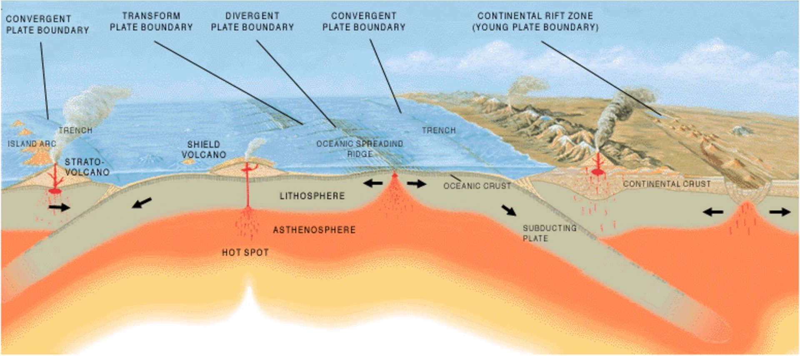

# Quiz: Rocks

IN THE SPACE BELOW, WRITE OUT IN FULL AND THEN SIGN THE HONOR PLEDGE:

“I pledge my honor that I have not violated the honor code during this examination.”

**PRINT NAME**:

By uploading this assignment through Canvas, I sign off on the document below electronically.

----

## Instructions

This is an open book, open notes quiz to be done independently, on your own.  But it is not open Internet - on your honor, you are not permitted to "Google" for answers.

Unless otherwise indicated the multiple choice questions have only one correct answer. Once started, you have 20 minutes to finish.

When done, click **Submit Quiz** at the bottom of the page.  Note that by submitting this quiz, you are acknowledging the following statement:

       “I pledge my honor that I have not violated the honor code during this examination.”
Please tick your choice(s) from the list of options provided.  Note that <u>several choices may be correct</u>, so tick all choices you think are appropriate.

----

Q1. Which of the following determines the composition of a magma? Check all that apply.
1. The degree of partial melting of the rocks that melt to form the magma
2. The composition of the rocks that melt to form the magma
3. The age of the rocks that melt to form the magma
4. Whether the melting occurs close to Earth's surface or at depth

Q2. How do intrusive and extrusive igneous rocks differ? Check all that apply.
  1. Intrusive igneous rocks have larger grains than extrusive igneous rocks.
  2. Intrusive igneous rocks have smaller grains than extrusive igneous rocks.
  3. Intrusive igneous rocks are more felsic than extrusive igneous rocks.
  4. Intrusive igneous rocks are more mafic than extrusive igneous rocks.
  5. Intrusive igneous rocks cool more quickly than extrusive igneous rocks.
  6. Intrusive igneous rocks cool more slowly than extusive igneous rocks.

Q3. Viscosity of a magma depends on which of the following. Check all that apply.
  1. temperature
  2. iron/magnesium content
  3. silica content
  4. volume of the magma body 

Q4. In which tectonic settings would you expect to generate basaltic magma?  Check all that apply.

  1. island arc above a subducting plate 
  2. shield volcano above an oceanic hot spot 
  3. oceanic spreading ridge
  4. above a subducting plate in an oceanic plate/continental crust above a subducting plate
  5. continental rift 

Q5. The process of fractional crystallization results in a residual magma that is:
  1. depleted in silica, compared to the parent magma.
  2. enriched in silica, compared to the parent magma.  
  3. the same composition as the parent magma.

Q6. What is the difference between a rock with a clastic texture and rock with a a crystalline texture?
  1. A clastic rock contains rounded grains held together by a cementing material, whereas a crystalline rock contains angular grains held together with cement.
  2. A clastic rock contains grains formed by chemical precipitation, whereas crystalline rocks contain grains formed by erosion of pre-existing rocks.
  3. A clastic rock contains grains held together by their interlocking ground boundaries, whereas a crystalline rock contains grains held by cement.
  4. A clastic rock contains grains held together by cement, whereas a crystalline rock contain grains held together by their interlocking grain boundaries.

Q7. Order the steps that go into making a sedimentary rock from 1 (first step) to 5 (final step).
  1. erosion 
  2. cementation
  3. transportation
  4. weathering
  5. deposition
  
*Note*: Correct order is 2,5,3,1,4

Q8. Metamorphism typically involves which of the following processes?
  1. Solid state recrystallization
  2. Fractional crystallization 
  3. Partial melting

Q9. In a few sentences, in your own words, describe how sedimentary layering (bedding) is formed.

Q10. In a few sentences, in your own words, describe how metamorphic layering (foliation) is formed.
