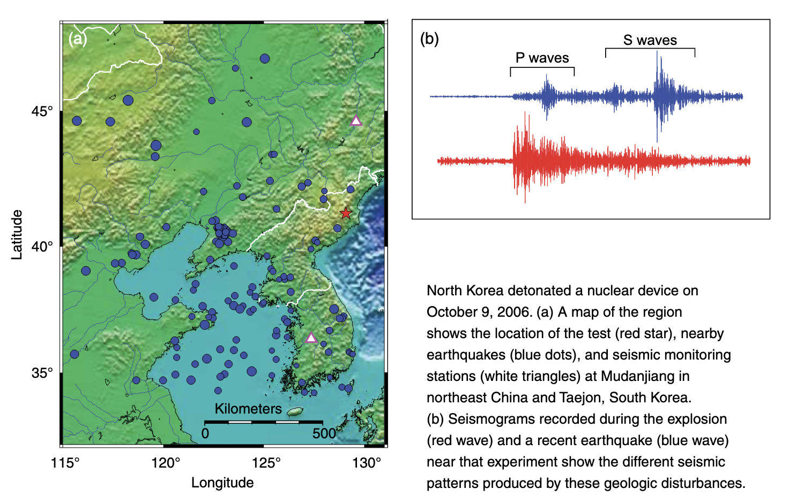

# Quiz: Seismology

IN THE SPACE BELOW, WRITE OUT IN FULL AND THEN SIGN THE HONOR PLEDGE:

“I pledge my honor that I have not violated the honor code during this examination.”

**PRINT NAME**:

By uploading this assignment through Canvas, I sign off on the document below electronically.

----

## Instructions

This is an open book, open notes quiz to be done independently, on your own.  But it is not open Internet - on your honor, you are not permitted to "Google" for answers.

Unless otherwise indicated the multiple choice questions have only one correct answer. Once started, you have 20 minutes to finish.

When done, click **Submit Quiz** at the bottom of the page.  Note that by submitting this quiz, you are acknowledging the following statement:

       “I pledge my honor that I have not violated the honor code during this examination.”
Please tick your choice(s) from the list of options provided.  Note that <u>several choices may be correct</u>, so tick all choices you think are appropriate.

----

Q1. Why does Hooke's law apply for earthquakes?

  1. Because earthquakes strain Earth materials beyond their elastic limit 
Correct Answer
  2. Because of a linear relationship between stress on the fault and the small strains involved
  3. Because earthquakes cause permanent strain or deformation around the epicenter 
  4. Because earthquakes involve inelastic strains and fast strain rates 

Q2. Which of the following are true about P waves and S-waves (choose all that apply):

  1. P-waves travel faster than S-waves
  2. S-waves travel faster than P-waves 
  3. P-wave particle motion is perpendicular to the wave propagation direction  
  4. P-wave particle motion is parallel to the wave propagation direction  
  5. S-wave particle motion is perpendicular to the wave propagation direction
  6. S-wave particle motion is parallel to the wave propagation direction

Q3. Which would be more efficient in generating S-waves: an earthquake along a fault or a nuclear bomb blast?  Give your answer and justify it in a sentence or two.

*Note*:
Tectonic earthquake typically involve shear motion along a fault, in which  the two sides of the fault move sideways against one another.  This is very efficient at generating S-waves which involve motion perpendicular to the wave propagation direction.  Earthquake seismograms typically show weak P-waves and strong S-waves.   Explosions however, involve motion outward/inward from the source in all directions without shear motion.  Explosion seismograms typically show strong P-waves and indistinct S-waves.  See the example below (from the March 2009 issue of Lawrence Livermore Laboratory's Science and Technology Review):

Q4. Which of the following directly affects seismic wave velocities? (Check all that apply)

  1. Magnitude of the earthquake that produces the eathquake
  2. Type of fault that produces the earthquake
  3. Composition of the material the waves travel through   
  4. Temperature of the material that the wave travels through  
  5. Liquid vs. solid nature of the material the wave travels though
  6. Whether the earthquake was caused by movement along a fault or an explosion (e.g. nuclear bomb test) 

Q5. The velocity of body waves can be expressed in terms of the physical properties of the material they are traveling through:

density $\rho$

bulk modulus $\kappa$

rigidity (shear) modulus $\mu$

Which of the following is a correct statement of the velocity of P-waves:
  1. $V=\sqrt{\frac{(\kappa+\frac{4}{3}\mu)}{\rho}}$ for P waves, which travel through liquids
  2. $V=\sqrt{\frac{(\kappa+\frac{4}{3}\mu)}{\rho}}$ for P waves, which do not travel through liquids
  3. $V=\sqrt{\frac{\mu}{\rho}}$ for P waves, which do travel through liquids
  4. $V=\sqrt{\frac{\mu}{\rho}}$ for P waves, which do not travel through liquids

Q6. Why does velocity of seismic waves typically increase with depth?  Check all that apply

  1. Higher pressures increase elastic moduli, and thus materials are stiffer
  2. Higher temperatures promote more efficient transfer of seismic energy
  3. Higher density leads to higher seismic velocity 
  4. Phase changes at depth tend to form stiffer rocks

Q7. Why do body waves travel along curved paths through the Earth?
  1. Because the Earth’s temperature increases with depth. 
  2. Because the base of the lithosphere interferes with direct passage of seismic waves through the asthenosphere. 
  3. Because of refraction of waves by layers of different seismic wave velocities.   
  4. Because of wave reflection at Earth's internal boundaries (crust, mantle, inner core, outer core) 

Q8. Which choice describes evidence for a liquid outer core, illustrated in the figure below.

   1. Development of a shadow zone when the P-wave velocity (V1) in the mantle is lower than than in the outer core (V2).
   2. Development of a shadow zone when the P-wave velocity (V1) in the mantle is higher than than in the outer core (V2). 
   3. Development of a shadow zone when the S-wave velocity (V1) in the mantle is higher than than in the outer core (V2).
   4. Development of a shadow zone when the S-wave velocity (V1) in the mantle is lower than than in the outer core (V2).

Q9. Which of the following are true about surface waves?  (Check all that apply.)

   1. Surface waves are the first waves to arrive at a seismic station after an earthquake  
   2. Surface waves are slower than body waves.   
   3. Surface waves produce most of the damage to buildings during earthquakes  
   4. Surface waves deform material in the upper mantle and are therefore sensitive to properties at these shallow depths   
   5. Because of dispersion, surface waves at various frequencies can be used to image subsurface structure. 
